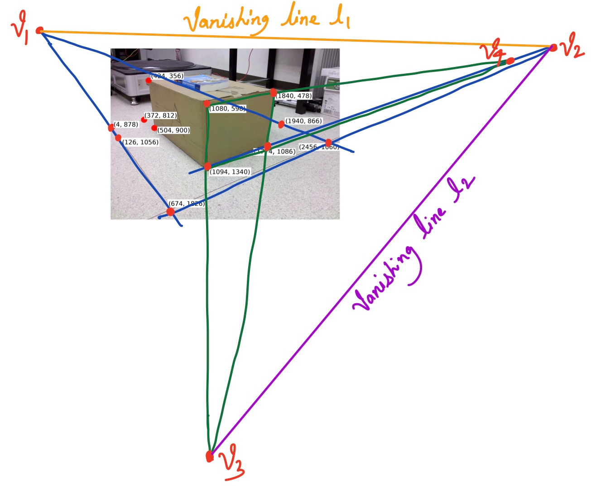

# Camera Intrinsic Calibration from a Single Image

Estimating camera intrinsic parameters is essential for any computer vision task. Usually, this entails using a calibration rig of known dimensions which contains a simple pattern like a checkerboard. By using at least 6 correspondences, we can obtain 12 constraints since each correspondence provides us with 2 constraints in x and y. This allows us to solve for extrinsic and intrinsic matrix together, which is a 3x4 matrix and has 11 degrees-of-freedom.

An easier but less accurate way of estimating intrinsic matrix is by making use of orthogonal planes and by leveraging our knowledge about the world. Vanishing points in the image plane define 2D projections of 3D points at infinity, and one can compute the 3D ray vector given the 2D coordinate of the vanishing point and camera intrinsic matrix, K. We utilize this property to get a constraint by each pair of vanishing points. Thus, with a minimum of 3 vanishing points, we get 3 constraints to solve the intrinsic matrix. By making (1) square pixels, and (2) zero-skew assumption, we reduce the degrees of freedom to 3, and can estimate the camera parameters.

The first step in this calibration is to identify keypoints on 3 orthogonal planes. In this particular case, the 3 identified planes are *floor plane*, *right side of the box*, and *fron side of the box*.  


From these points, we can compute lines and their intersection at the *vanishing point*. More than one *vanishing point* in each plane together define a *vanishing line*. These *vanishing points* are then used to estimate camera intrinsics utilizing the fact that the angles between a pair of vanishing lines is 90 degrees.  



```
Estimated Intrinsic Matrix:
 [[2.59416989e+03 0.00000000e+00 7.73289532e+02]
 [0.00000000e+00 2.59416989e+03 9.79503297e+02]
 [0.00000000e+00 0.00000000e+00 1.00000000e+00]]

Actual Matrix:
 [[2.448e+03 0.000e+00 1.253e+03]
 [0.000e+00 2.438e+03 9.860e+02]
 [0.000e+00 0.000e+00 1.000e+00]]

Angle between floor and box: 89.97263875896901
```

Furthermore, if same points can be tracked in a different frame captured from a camera with a different pose, then these *vanishing points* can be used to compute the new rotation matrix. It is however limited to rotation only and cannot be used to estimate the translation between cameras.  

```
Rotation between two cameras:
 [[ 0.96154157  0.04924778 -0.15783349]
 [-0.01044314  1.00703585  0.04571333]
 [ 0.18940319 -0.06891607  1.00470583]]

Angle around z-axis (pointing out of camera): -2.931986 degrees
Angle around y-axis (pointing vertically): -8.918793 degrees
Angle around x-axis (pointing horizontally): -2.605117 degrees
```